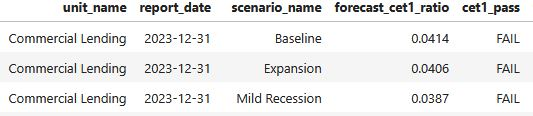

# Capital Adequacy Forecasting – Basel III Compliance Simulation

**Click the image below to watch a short (40 second) video introduction to the project**

[](https://youtu.be/4nfzWkHwxtY)

This project is a simple forecasting tool that estimates whether a hypothetical financial institution would meet regulation requirements under various economic scenarios. It focuses on Basel III regulation and uses sample balance sheet inputs, SQL-based tier calculations, and basic scenario forecasting logic.



## 🛠️ How to Run This Project

This project is written in Python using a Jupyter Notebook.

---

### Run Locally (Recommended)

If you have Jupyter Notebook, VS Code, or Anaconda installed:

1. **Clone the repo:**
   ```bash
   git clone https://github.com/markizevbigie/capital-forecasting-microproject
   cd capital_forecasting_microproject
2. **Open the notebook:**
    - Launch Jupyter Notebook or VS Code
    - Open capital_forecasting_microproject.ipynb
3. **Run all cells.**
    - All required packages are standard, but see the “Dependencies” section below for exact versions or install the required dependencies with
    `pip install -r requirements.txt`

## Key Features

- SQLite + SQL Magic in Jupyter
- Relational schema with foreign keys and realistic financial modeling
- Basel III ratio checks and tier-specific compliance logic
- Forecast scenario simulation (baseline, mild/severe recession, expansion)
- Use of CTEs, joins, and CASE logic for clear and auditable calculations

## Tables

- `business_units`: Simulated departments (e.g., Retail Banking, Wealth Management)
- `balance_sheets`: CET1, AT1, Tier 2 capital vs. risk-weighted exposure
- `forecast_assumptions`: Scenario-based multipliers
- `regulatory_requirements`: Basel III minimums per tier

## Why It Matters

This project demonstrates a working understanding of regulatory capital frameworks and the ability to implement robust SQL logic for real-world financial risk analysis.

## Future Enhancements

- Add real data from 10-K/Pillar 3 filings
- Automate with Python or build out a front-end dashboard

## Dependencies

This notebook was developed using the following dependencies:

   - Python 3.11

   - sqlalchemy==1.4.39 ✅ (Note: newer 2.x versions may cause errors)

   - ipython-sql

   - sqlparse