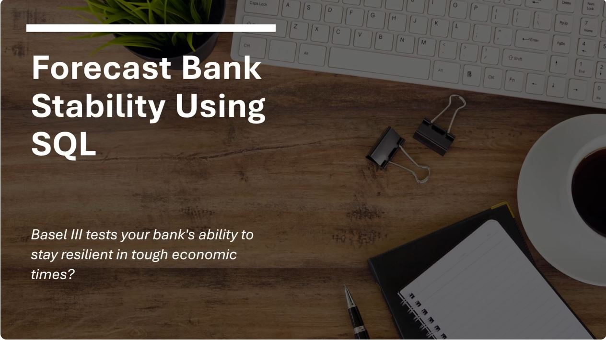

# Capital Adequacy Forecasting – Basel III Compliance Simulation

**Click the image below to watcha a short (less that 60 seconds) video introduction to the project**

This SQL-focused project simulates capital adequacy forecasting under Basel III regulatory requirements. It uses a fictional dataset of business units, capital structures (CET1, AT1, Tier 2), and macroeconomic forecast scenarios.

## Key Features

- SQLite + SQL Magic in Jupyter
- Relational schema with foreign keys and realistic financial modeling
- Basel III ratio checks and tier-specific compliance logic
- Forecast scenario simulation (baseline, mild/severe recession, expansion)
- Use of CTEs, joins, and CASE logic for clear and auditable calculations

## Tables

- `business_units`: Simulated departments (e.g., Retail Banking, Wealth Management)
- `balance_sheets`: CET1, AT1, Tier 2 capital vs. risk-weighted exposure
- `forecast_assumptions`: Scenario-based multipliers
- `regulatory_requirements`: Basel III minimums per tier

## Why It Matters

This project demonstrates a working understanding of regulatory capital frameworks and the ability to implement robust SQL logic for real-world financial risk analysis.

## Future Enhancements

- Add real data from 10-K/Pillar 3 filings
- Automate with Python or build out a front-end dashboard

